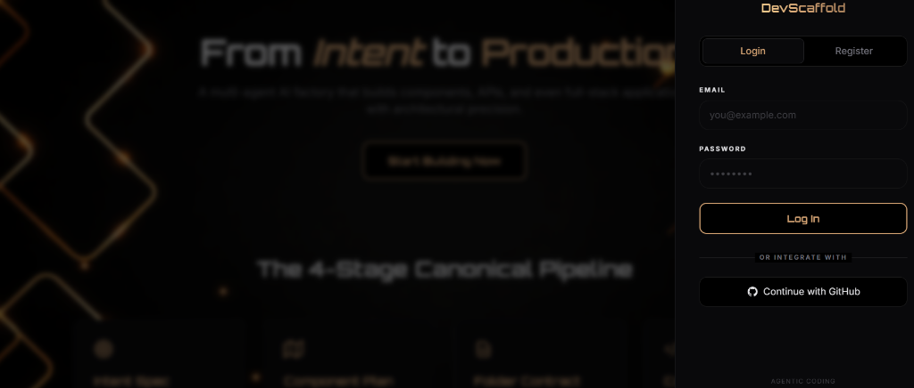
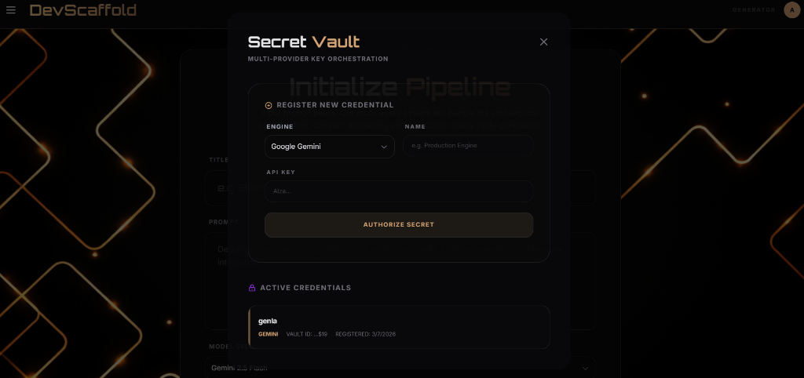
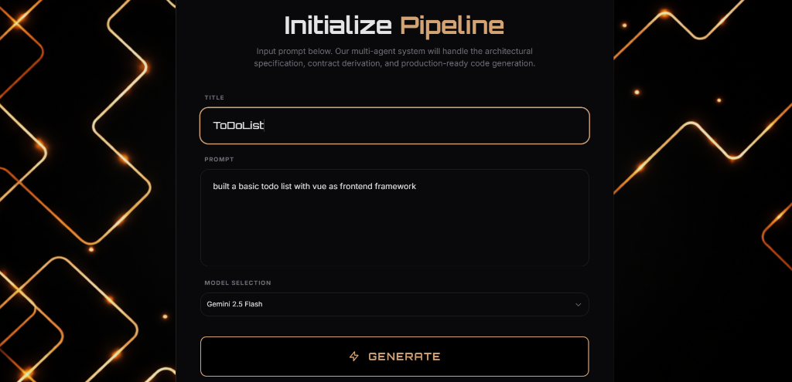
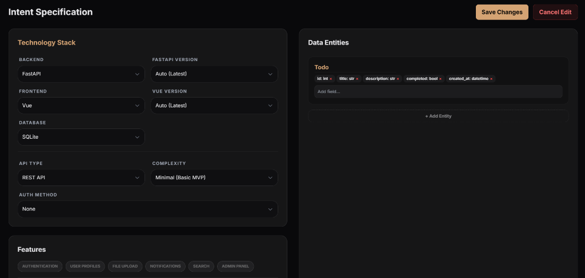
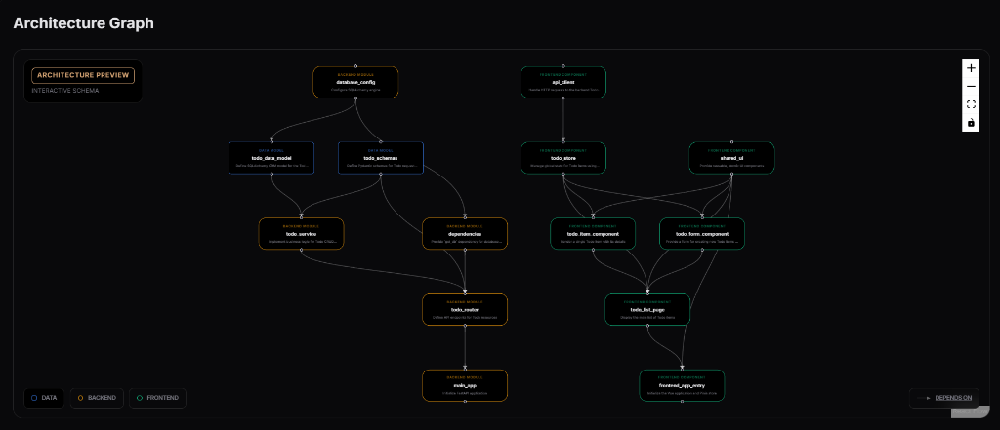
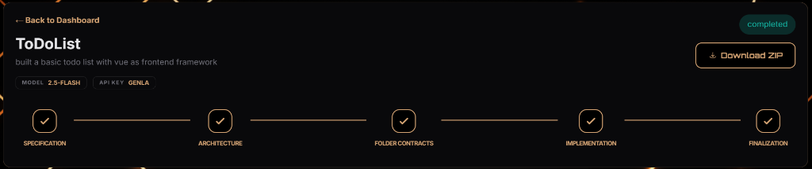
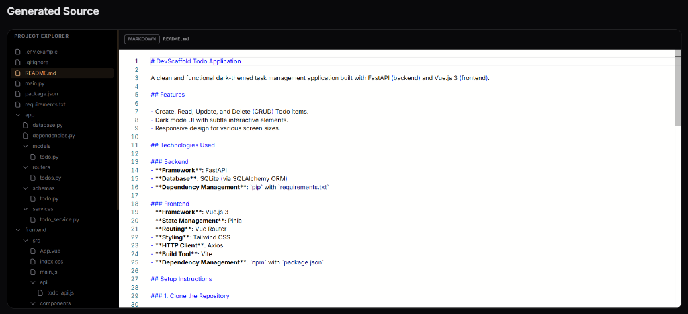

# DevScaffold: Intelligent Multi-Agent Project Sculptor 🏗️🚀

DevScaffold is an advanced agentic coding platform that transforms natural language intent into high-fidelity, runnable repositories. It uses a structured multi-agent pipeline powered by Google Gemini to ensure deterministic architectural consistency and high code quality.

# DevScaffold — Highlights

> For recruiters, engineers, and collaborators reviewing the technical depth of this project.

---

## What Makes This Different

### 1. Custom 5-Stage Multi-Agent Pipeline (No LangChain)
Engineered a stateless multi-agent code generation pipeline — PromptExpander → SpecBuilder → ContractBuilder → 3-phase GenerationEngine → Assembler — without LangChain Agents. Used Google GenAI SDK directly for native Pydantic schema enforcement, RetryInfo-aware retry logic, and mid-run API key rotation. Achieves one-shot prototype generation from prompts as short as 5–10 words.

### 2. Verified Generation Quality — 75–96% First-Shot Completion
Generation quality is measured using a custom weighted effort scoring formula:

```
E = Σ Sw(s) × [1.5·Lm(s) + 1.0·La(s) + 0.5·Ld(s)]
```

Where significance weights (project-breaking = 4, functional = 2, UI = 1) are multiplied against operation costs (modified = 1.5, added = 1.0, deleted = 0.5) per category. Environment-specific setup is excluded from scoring to isolate true generation quality. Verified 75–96% first-shot completion across test runs in 3–8 minutes depending on model and project complexity.

### 3. Sliding-Window ProjectManifest (Typed Source of Truth)
Designed a phase-aware ProjectManifest — Pydantic-typed, self-pruning between pipeline stages — that sheds stale context at each phase boundary while preserving `creative_vision` metadata (e.g. "90s terminal aesthetic", "cosmic gold dark theme") as a propagated constraint through all downstream agents. Solves the core coordination problem in multi-agent LLM systems: what to keep vs. discard across phases.

### 4. Typed Cross-Layer Contract Enforcement
Enforced inter-phase integration via a `CrossLayerContractSchema` — the backend generation phase outputs exact port, auth header format, token field name, and WebSocket library into a Pydantic-validated contract consumed verbatim by the frontend phase. Eliminates cross-layer integration drift by design rather than by convention.

### 5. Two-Layer Runtime RAG — Zero Vector DB
Built a two-layer RAG system: static framework reference docs (Django, FastAPI, React, Vue, Express, Spring Boot) pre-embedded with MD5-keyed `.npy` disk caching, dynamically augmented at runtime by LLM-synthesized domain knowledge derived from the user's own prompt. Implemented entirely with NumPy and Gemini Embeddings — no Pinecone, no Chroma, no additional infrastructure.

### 6. BYOAK Multi-Key Rotation with Circuit Breaking
Implemented Bring Your Own API Key (BYOAK) architecture with LRU-based multi-key selection, RetryInfo-parsed exponential backoff (reads Gemini's exact recommended wait duration from error details), and daily quota circuit-breaking — sustaining uninterrupted generation across mid-run key exhaustion with zero platform API credit exposure.

### 7. Deterministic Assembly Layer
The final assembly stage is fully LLM-free — validates all generated file paths against the manifest directory layout, auto-generates Python `__init__.py` across backend directories, appends the full pipeline action log to the output README, and uploads to S3. Correctness guaranteed by structure, not by inference.


## 🖼️ Visual Product Tour (The 7-Step Journey)

DevScaffold uses a structured, multi-agent pipeline to transform intent into production-ready assets.

### 1. Secure Identity
Authenticate via **GitHub OAuth** or manual **Email/Password** to persist your project history and secrets in the cloud.


### 2. Fuel the Factory (Secret Vault)
Securely register your **Google Gemini API Keys** in the Vault. Our engine uses multiple keys to orchestrate parallel agentic reasoning.


### 3. Define Vision
Describe your application in natural language. From simple CRUD apps to complex enterprise systems, the prompt is your only limit.


### 4. Verify Blueprint (Intent Spec)
Review the auto-generated **Intent Specification**. Refine the tech stack, database schema, and core features before the build begins.


### 5. Architecture Graph
Visualize the logical dependency graph and component mapping derived from your specification.


### 6. Agentic Build
Watch the multi-agent pipeline execute folder contracts, implement business logic, and generate the UI in real-time.


### 7. Own the Asset
Download your production-ready, clean source code as a ZIP. Zero-entropy, deterministic output ready for deployment.


## 🛠️ Tech Stack

- **Backend**: Python 3.12, Django 5.x, PostgreSQL.
- **Frontend**: React 18, Vite, Tailwind CSS (Mobile Responsive, Dark Mode Only).
- **AI Engine**: Google Gemini (Direct Prototyping & Generation).

## 🚀 Getting Started

### Prerequisites

- Python 3.12+
- Node.js 20+
- PostgreSQL
- Google Gemini API Key

### Backend Setup

1.  Navigate to `backend/`.
2.  Create a virtual environment: `python -m venv venv`.
3.  Activate it: `venv\Scripts\activate` (Windows) or `source venv/bin/activate` (Mac/Linux).
4.  Install dependencies: `pip install -r requirements.txt`.
5.  Configure `.env` (use `.env.example` as a template).
6.  Run migrations: `python manage.py migrate`.
7.  Start server: `python manage.py runserver`.

### Frontend Setup

1.  Navigate to `frontend/`.
2.  Install dependencies: `npm install`.
3.  Start dev server: `npm run dev`.

## ⚙️ Environment Variables

### Backend (`backend/.env`)
| Variable | Description |
| :--- | :--- |
| `ENCRYPTION_KEY` | **CRITICAL**: 44-byte Fernet key for API storage. |
| `GITHUB_CLIENT_ID` | OAuth Client ID from GitHub Developers portal. |
| `GITHUB_CLIENT_SECRET` | OAuth Client Secret from GitHub Developers portal. |
| `AWS_ACCESS_KEY_ID` | AWS IAM Access Key for S3 storage. |
| `AWS_SECRET_ACCESS_KEY` | AWS IAM Secret Access Key for S3 storage. |
| `AWS_STORAGE_BUCKET_NAME`| Your unique S3 bucket name. |
| `AWS_S3_REGION_NAME` | S3 bucket region (e.g., `ap-south-2`). |
| `REPO_RETENTION_HOURS`| Hours before a project is deleted (default: `24`). |

### Frontend (`frontend/.env`)
| Variable | Description |
| :--- | :--- |
| `VITE_API_URL` | Full URL to the backend API. |

## 🌐 Production Deployment

### Backend (Render)
- **Runtime**: Python 3.
- **S3 Persistence**: All project repositories and ZIP files are stored in AWS S3. This ensures data survives Render's ephemeral disk wipes during redeployment.
- **Auto-Sanitization**: The code automatically strips quotes and whitespace from `ENCRYPTION_KEY`.

### Frontend (Vercel)
- **Responsive**: The UI is now fully optimized for mobile devices using native viewport scaling.

## 🧹 Maintenance & Storage
- **Cleanup Cron**: A GitHub Action (`.github/workflows/cleanup_cron.yml`) triggers a secure cleanup of expired repositories every 24 hours.
- **Manual Cleanup**: You can run the cleanup command manually from the backend directory:
  ```bash
  python manage.py cleanup_repos
  ```
  Add `--dry-run` to see what would be deleted without actually removing files.

## 📜 License

This project is licensed under the MIT License - see the `LICENSE` file for details.
